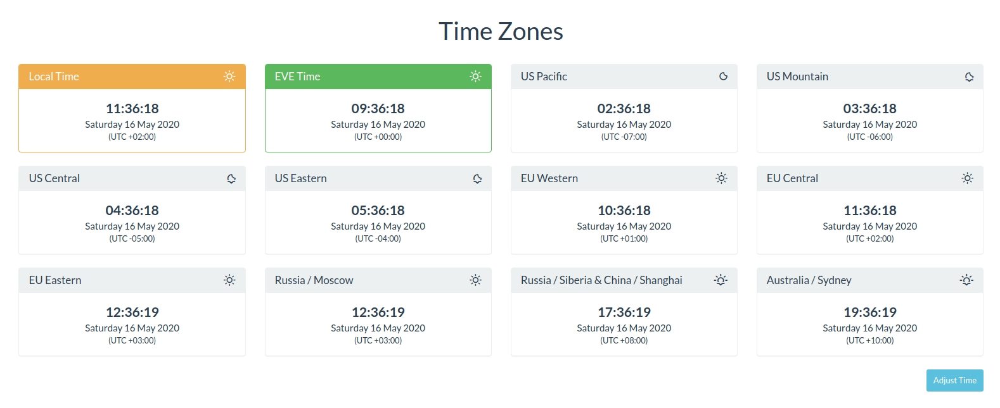

# AA Time Zones

App for displaying different time zones with Alliance Auth



## Contents

- [Installation](#installation)
- [Updating](#updating)
- [Change Log](CHANGELOG.md)


## Installation

**Important**: This app is a plugin for Alliance Auth. If you don't have Alliance Auth running already, please install it first before proceeding. (see the official [AA installation guide](https://allianceauth.readthedocs.io/en/latest/installation/auth/allianceauth/) for details)

### Step 1 - Install app

Make sure you are in the virtual environment (venv) of your Alliance Auth installation. Then install the newest release from PyPI:

```bash
pip install git+https://github.com/ppfeufer/aa-timezones.git
```

### Step 2 - Update Eve Online app

Configure your AA settings (`local.py`) as follows:

- Add `'timezones'` to `INSTALLED_APPS`


### Step 3 - Finalize installation into AA

Run migrations & copy static files

```bash
python manage.py collectstatic
python manage.py migrate
```

Restart your supervisor services for AA

### Step 4 - Setup permissions

Now you can setup permissions in Alliance Auth for your users. Add ``timezones|aa timezones|Can access ths app`` to the states and/or groups you would like to have access.

## Updating

To update your existing installation of AA Time Zones first enable your virtual environment.

Then run the following commands from your AA project directory (the one that contains `manage.py`).

```bash
pip install git+https://github.com/ppfeufer/aa-timezones.git --upgrade
```

```bash
python manage.py collectstatic
```

```bash
python manage.py migrate
```

Finally restart your AA supervisor services.
